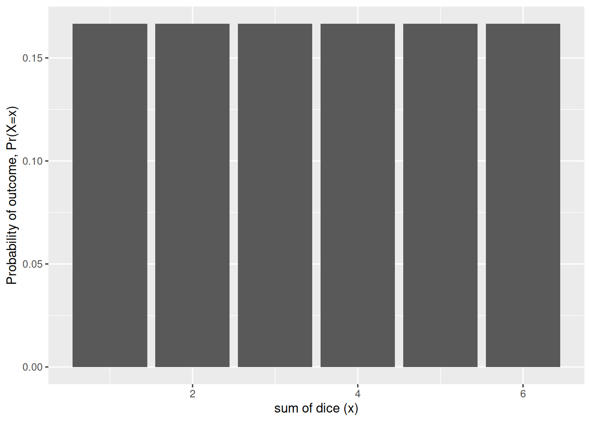

# Limit theorems

Code

- [Show All Code](javascript:void(0))

- [Hide All Code](javascript:void(0))

- 

  ------------------------------------------------------------------------

- [View Source](javascript:void(0))

Published

Last modified: 2026-10-08 12:54:59 (PDT)

## 1 The Central Limit Theorem

> **NOTE:**
>
> *Remark*. The sum of many independent random variables, none of which dominates the others, has a distribution that is approximately bell-shaped, whatever the distributions of the individual variables. [Theorem 1](#thm-clt) makes this precise.

> **NOTE:**
>
> **Theorem 1 (Central Limit Theorem)** Let \\X_1, X_2, \ldots\\ be [IID](independence.llms.md#def-iid) random variables with mean \\\mu\\ and finite variance \\\sigma^2\> 0\\, and let \\S_n \stackrel{\text{def}}{=}\sum\_{i=1}^nX_i\\. Then for every real number \\z\\:
>
> \\ \lim\_{n \to \infty} \Pr\mathopen{}\left(\frac{S_n - n\mu}{\sigma\sqrt{n}} \le z\right)\mathclose{} = \Phi(z) \\
>
> where \\\Phi(z) \stackrel{\text{def}}{=}\int\_{-\infty}^{z} \frac{1}{\sqrt{2\pi}} \text{e}^{-u^2/2}\\du\\ is the CDF of the [standard normal distribution](random-variables.llms.md#def-std-normal) \\\operatorname{N}\mathopen{}\left(0, 1\right)\mathclose{}\\.

> **NOTE:**
>
> *Remark*. This version is the Lindeberg–Lévy CLT; its proof is beyond these notes’ scope ([Billingsley 1995](#ref-billingsley1995probability), Theorem 27.1). Other versions relax the IID assumption, which is why the informal statement asks only that no summand dominate.

> **NOTE:**
>
> **Corollary 1 (Mean and variance of a sum of IID random variables)** Let \\X_1, \ldots, X_n\\ be [IID](independence.llms.md#def-iid) random variables, each discrete or continuous, with mean \\\mu\\ and finite variance \\\sigma^2\\, and let \\S_n \stackrel{\text{def}}{=}\sum\_{i=1}^nX_i\\. Then:
>
> \\ \begin{aligned} \operatorname{E}\mathopen{}\left\[S_n\right\]\mathclose{} &= n\mu \\ \operatorname{Var}\mathopen{}\left(S_n\right)\mathclose{} &= n\sigma^2 \end{aligned} \\

> **NOTE:**
>
> *Proof*. For the mean, apply [linearity of expectation](expectation.llms.md#thm-linearity-expectation) once per added summand:
>
> \\ \begin{aligned} \operatorname{E}\mathopen{}\left\[S_n\right\]\mathclose{} &= \sum\_{i=1}^n\operatorname{E}\mathopen{}\left\[X_i\right\]\mathclose{} && \text{(linearity of expectation, applied } n - 1 \text{ times)} \\ &= n\mu && \text{(each } X_i \text{ has mean } \mu \text{)} \end{aligned} \\
>
> For the variance, apply the [variance of a linear combination](variance-covariance.llms.md#thm-var-lincom) with every \\a_i = 1\\. For \\i \ne j\\, \\X_i\\ and \\X_j\\ are independent (take \\A_k = \mathbb{R}\\ for every other \\k\\ in the [definition of independence](independence.llms.md#def-indpt)), so \\\operatorname{Cov}\mathopen{}\left(X_i, X_j\right)\mathclose{} = 0\\ for [independent summands](variance-covariance.llms.md#thm-indpt-uncorrelated); and \\\operatorname{Cov}\mathopen{}\left(X_i, X_i\right)\mathclose{} = \operatorname{Var}\mathopen{}\left(X_i\right)\mathclose{}\\ ([covariance of a variable with itself](variance-covariance.llms.md#lem-cov-xx)):
>
> \\ \begin{aligned} \operatorname{Var}\mathopen{}\left(S_n\right)\mathclose{} &= \sum\_{i=1}^n\sum\_{j=1}^n \operatorname{Cov}\mathopen{}\left(X_i, X_j\right)\mathclose{} && \text{(variance of a linear combination, all } a_i = 1 \text{)} \\ &= \sum\_{i=1}^n\operatorname{Cov}\mathopen{}\left(X_i, X_i\right)\mathclose{} + \sum\_{\substack{i, j = 1 \\ i \ne j}}^n \operatorname{Cov}\mathopen{}\left(X_i, X_j\right)\mathclose{} && \text{(split off the terms with } i = j \text{)} \\ &= \sum\_{i=1}^n\operatorname{Var}\mathopen{}\left(X_i\right)\mathclose{} + 0 && \text{(covariance with itself; independent summands)} \\ &= n\sigma^2 && \text{(each } X_i \text{ has variance } \sigma^2\text{)} \end{aligned} \\

> **NOTE:**
>
> *Remark*. In practice, [Theorem 1](#thm-clt) justifies approximating \\S_n\\ by a normal distribution with mean \\n\mu\\ and variance \\n\sigma^2\\, which by [Corollary 1](#cor-sum-iid-moments) are exactly the mean and variance of \\S_n\\.

> **NOTE:**
>
> **Example 1 (The sum of five dice)** A single fair die roll has the discrete uniform distribution on \\\mathopen{}\left\\1, \ldots, 6\right\\\mathclose{}\\, which is flat, not bell-shaped ([Figure 1](#fig-clt-1d6)). Its mean is \\\mu = 3.5\\, and its variance is \\\sigma^2= \sum\_{x=1}^{6} (x - 3.5)^2 / 6 = 35/12\\.
>
> Show code
>
> ``` r
> dice_sum_pmf <- function(n_dice) {
>   totals <- rowSums(expand.grid(rep(list(1:6), n_dice)))
>   probs <- prop.table(table(totals))
>   data.frame(total = as.numeric(names(probs)), p = as.vector(probs))
> }
>
> dice_plot <-
>   ggplot2::ggplot(mapping = ggplot2::aes(x = total, y = p)) +
>   ggplot2::xlab("sum of dice (x)") +
>   ggplot2::ylab("Probability of outcome, Pr(X=x)") +
>   ggplot2::expand_limits(y = 0)
>
> dice_plot + ggplot2::geom_col(data = dice_sum_pmf(1))
> ```
>
> [](limit-theorems_files/figure-html/fig-clt-1d6-1.png "Figure 1: Distribution of the outcome of one die")
>
> Figure 1: Distribution of the outcome of one die
>
> The sum of five independent rolls, \\S_5\\, is already close to bell-shaped ([Figure 2](#fig-clt-5d6)).
>
> Show code
>
> ``` r
> pmf_five_dice <- dice_sum_pmf(5)
> dice_plot + ggplot2::geom_col(data = pmf_five_dice)
> ```
>
> [](limit-theorems_files/figure-html/fig-clt-5d6-1.png "Figure 2: Distribution of the sum of five dice")
>
> Figure 2: Distribution of the sum of five dice
>
> For example, the exact probability that five dice total at most 15 is \\\Pr(S_5 \le 15) = 0.3052\\. The normal approximation that [Theorem 1](#thm-clt) suggests, with mean \\5 \cdot 3.5 = 17.5\\ and variance \\5 \cdot 35/12 \approx 14.58\\, evaluated at \\15.5\\ to account for \\S_5\\ taking only integer values, gives \\\Phi\mathopen{}\left((15.5 - 17.5)/\sqrt{14.58}\right)\mathclose{} \approx 0.3002\\.

> **NOTE:**
>
> **Example 2 (Sample means of car horsepower)** The Auto data record the horsepower and fuel economy of 392 car models sold between 1970 and 1982. They come from the StatLib library at Carnegie Mellon University and ship with the book *An Introduction to Statistical Learning*, in the Python package [`ISLP`](https://islp.readthedocs.io/) (`ISLP.load_data("Auto")`) and the R package [`ISLR2`](https://cran.r-project.org/package=ISLR2) (`ISLR2::Auto`). This repository holds a copy at `data/auto.csv`, and both code tabs below read that file.
>
> Horsepower is not bell-shaped: a few powerful cars give it a long right tail. To apply [Theorem 1](#thm-clt), treat each draw of one car at random as one IID observation \\X_i\\, so that \\\mu\\ and \\\sigma^2\\ are the mean and variance of the 392 horsepower values. The sum \\S_n\\ has mean \\n\mu\\ and variance \\n\sigma^2\\ by [Corollary 1](#cor-sum-iid-moments), so the sample mean \\S_n/n\\ has mean \\\mu\\ and standard deviation \\\sigma/\sqrt{n}\\. The code below draws 10,000 random samples of each size \\n \in \mathopen{}\left\\1, 5, 30\right\\\mathclose{}\\, with replacement, and computes each sample’s mean.
>
> ## Python
>
> ``` python
> import numpy as np
> import pandas as pd
>
> hp = pd.read_csv("data/auto.csv")["horsepower"].to_numpy(dtype=float)
> mu, sigma = hp.mean(), hp.std(ddof=0)
>
> rng = np.random.default_rng(571)
> sizes = [1, 5, 30]
> sample_means = {n: rng.choice(hp, size=(10_000, n)).mean(axis=1) for n in sizes}
>
> def skewness(x):
>     return np.mean(((x - x.mean()) / x.std()) ** 3)
>
> pd.DataFrame({
>     "n": sizes,
>     "sd of sample means": [sample_means[n].std(ddof=1) for n in sizes],
>     "sigma / sqrt(n)": [sigma / np.sqrt(n) for n in sizes],
>     "skewness of sample means": [skewness(sample_means[n]) for n in sizes],
> })
> #>     n  sd of sample means  sigma / sqrt(n)  skewness of sample means
> #> 0   1           38.691521        38.442033                  1.080767
> #> 1   5           17.265666        17.191800                  0.522243
> #> 2  30            6.971269         7.018523                  0.164940
> ```
>
> ## R
>
> ``` r
> hp <- read.csv("data/auto.csv")$horsepower
> mu <- mean(hp)
> sigma <- sqrt(mean((hp - mu)^2))
>
> set.seed(571)
> sizes <- c(1, 5, 30)
> sample_means <- lapply(sizes, function(n) {
>   replicate(10000, mean(sample(hp, n, replace = TRUE)))
> })
>
> skewness <- function(x) mean(((x - mean(x)) / sqrt(mean((x - mean(x))^2)))^3)
>
> data.frame(
>   n = sizes,
>   sd_of_sample_means = sapply(sample_means, sd),
>   sigma_over_root_n = sigma / sqrt(sizes),
>   skewness_of_sample_means = sapply(sample_means, skewness)
> )
> ```
>
> [Figure 3](#fig-clt-auto) shows a histogram of the 10,000 sample means for each \\n\\, with the normal density \\\operatorname{N}\mathopen{}\left(\mu, \sigma^2/n\right)\mathclose{}\\ from [Theorem 1](#thm-clt) drawn over it.
>
> Show code
>
> ``` r
> op <- par(mfrow = c(1, 3), mar = c(4, 4, 2, 1))
> for (k in seq_along(sizes)) {
>   hist(sample_means[[k]], breaks = 40, freq = FALSE,
>        main = paste("n =", sizes[k]), xlab = "sample mean of horsepower")
>   curve(dnorm(x, mu, sigma / sqrt(sizes[k])), add = TRUE, lwd = 2)
> }
> par(op)
> ```
>
> [](limit-theorems_files/figure-html/fig-clt-auto-1.png "Figure 3: Histograms of 10,000 sample means of horsepower, for samples of n = 1, 5 and 30 cars drawn with replacement from the Auto data. The curve is the normal density with mean mu and standard deviation sigma over the square root of n.")
>
> Figure 3: Histograms of 10,000 sample means of horsepower, for samples of n = 1, 5 and 30 cars drawn with replacement from the Auto data. The curve is the normal density with mean mu and standard deviation sigma over the square root of n.
>
> The sample means for \\n = 1\\ are just single cars, so they are skewed. By \\n = 30\\ the histogram is close to the normal curve. The standard deviation of the sample means is within 1.2% of \\\sigma/\sqrt{n}\\ at every \\n\\, as [Corollary 1](#cor-sum-iid-moments) predicts. The skewness of the sample means, which is zero for a normal distribution, falls from 1.07 at \\n = 1\\ to 0.48 at \\n = 5\\ and 0.2 at \\n = 30\\.

## References

Billingsley, Patrick. 1995. *Probability and Measure*. 3rd ed. Wiley Series in Probability and Mathematical Statistics. Wiley.

Back to top
