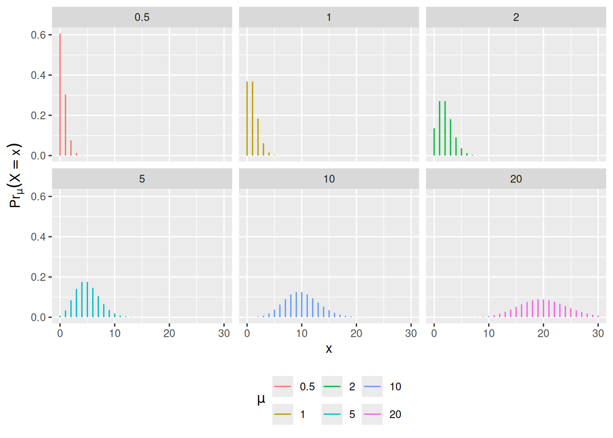
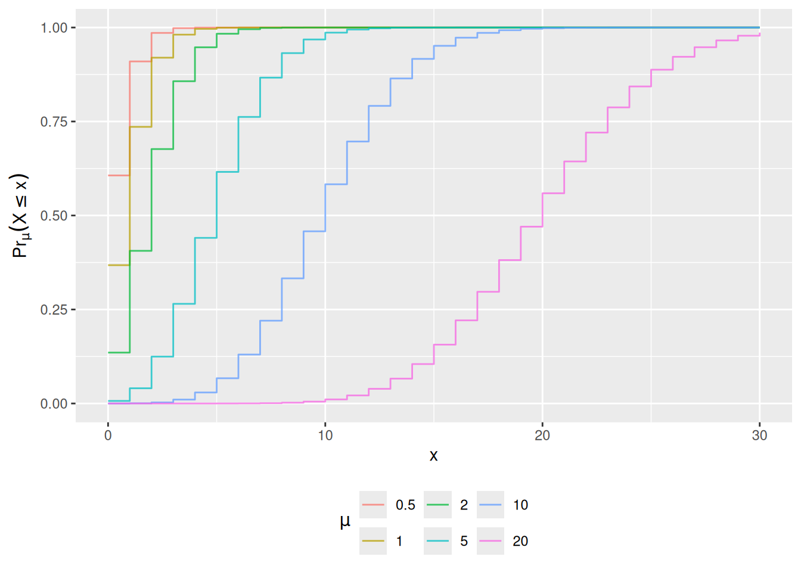
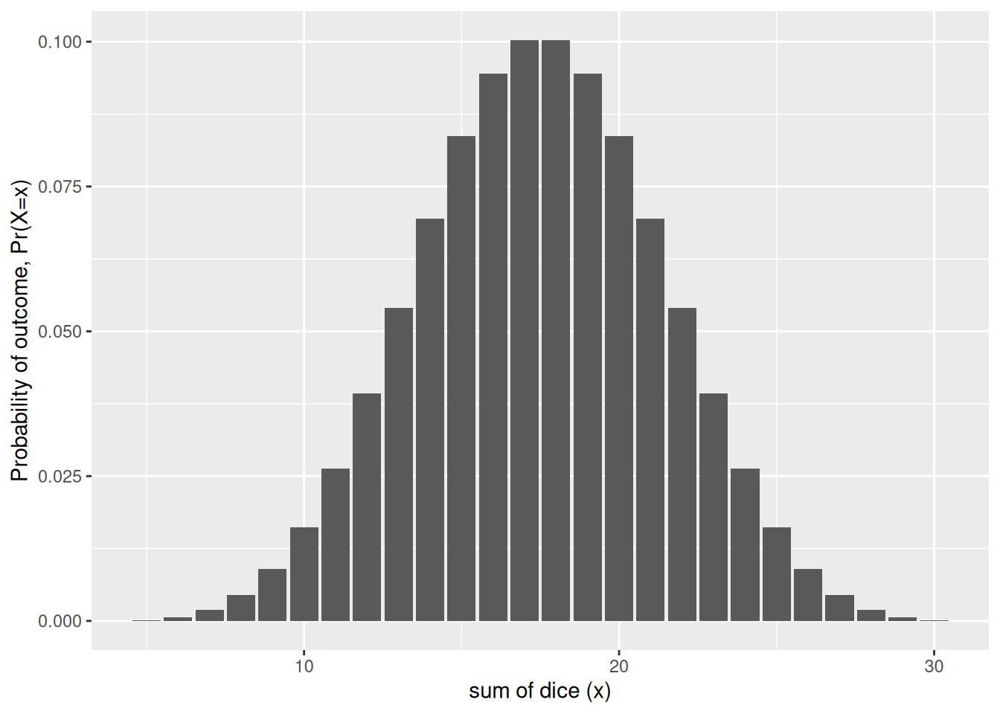

# Key distributions and the Central Limit Theorem

Code

- [Show All Code](javascript:void(0))

- [Hide All Code](javascript:void(0))

- 

  ------------------------------------------------------------------------

- [View Source](javascript:void(0))

Published

Last modified: 2026-09-28 01:15:08 (PDT)

# 1 Key probability distributions

Some distributions are typically used for outcome models ([Table 1](#tbl-outcome-distns)); other distributions are typically used for test statistics ([Table 2](#tbl-test-stat-distns)).

| Distribution | Uses |
|----|----|
| [Bernoulli](random-variables.llms.md#def-bernoulli) | Binary outcomes |
| Binomial | Sums of Bernoulli outcomes |
| Poisson | Unbounded count outcomes |
| Geometric | Counts of non-events before an event occurs |
| Negative binomial | Mixtures of Poisson distributions, counts of non-events until a given number of events occurs |
| [Normal (Gaussian)](random-variables.llms.md#def-normal) | Continuous outcomes without a more specific distribution |
| [Exponential](random-variables.llms.md#def-exponential) | Time to event outcomes |
| Gamma | Time to event outcomes |
| Weibull | Time to event outcomes |
| Log-normal | Time to event outcomes |

Table 1: Distributions typically used for outcome models

| Distribution | Uses |
|----|----|
| \\\chi^2\\ | Regression comparisons (asymptotic), contingency table independence tests, goodness-of-fit tests |
| \\F\\ | Gaussian model comparisons (exact) |
| \\Z\\ (standard normal) | Proportions, means, regression coefficients (asymptotic) |
| \\t\\ (Student’s) | Means, regression coefficients in Gaussian outcome models (exact) |

Table 2: Distributions typically used for test statistics

## 1.1 The Bernoulli distribution

> **NOTE:**
>
> **Example 1 (A coin flip)** The [Bernoulli distribution](random-variables.llms.md#def-bernoulli) describes a binary outcome. The indicator of heads on one flip of a fair coin is \\\operatorname{Ber}(1/2)\\. By the [expectation of the Bernoulli distribution](expectation.llms.md#thm-bernoulli-mean), \\X \sim \operatorname{Ber}(\pi)\\ has mean \\\pi\\, and by the [variance of a Bernoulli random variable](variance-covariance.llms.md#exm-variance-bernoulli), it has variance \\\pi(1 - \pi)\\.

## 1.2 The Poisson distribution

> **NOTE:**
>
> **Definition 1 (Poisson distribution)** A random variable \\Y\\ has the **Poisson distribution** with mean parameter \\\mu \> 0\\, written \\Y \sim \operatorname{Pois}(\mu)\\, if:
>
> \\\operatorname{P}(Y = y) \stackrel{\text{def}}{=}\frac{\mu^{y} e^{-\mu}}{y!}, \quad y \in \mathbb{N}= \mathopen{}\left\\0, 1, 2, \dots\right\\\mathclose{} \tag{1}\\

(see [Figure 1](#fig-pois-pmf))

> **NOTE:**
>
> **Exercise 1** What is the range of possible values for a Poisson distribution?

> **NOTE:**
>
> *Solution 1*. \\\mathcal{R}(Y) = \mathopen{}\left\\0, 1, 2, \dots\right\\\mathclose{} = \mathbb{N}\\

> **NOTE:**
>
> **Theorem 1 (CDF of Poisson distribution)** \\\operatorname{P}(Y \le y) = e^{-\mu} \sum\_{j=0}^{\mathopen{}\left\lfloor y\right\rfloor\mathclose{}}\frac{\mu^j}{j!} \tag{2}\\

> **NOTE:**
>
> *Proof*. For \\y \< 0\\, both sides are \\0\\ (the sum is empty). For any \\y \ge 0\\, the event \\\\Y \le y\\\\ is the disjoint union of events \\\\Y = j\\\\ for all non-negative integers \\j \le \mathopen{}\left\lfloor y\right\rfloor\mathclose{}\\. Applying the Poisson PMF ([Equation 1](#eq-pois-pmf)) and factoring out the common term \\e^{-\mu}\\:
>
> \\ \begin{aligned} \operatorname{P}(Y \le y) &= \sum\_{j=0}^{\mathopen{}\left\lfloor y\right\rfloor\mathclose{}} \operatorname{P}(Y = j) && (\text{disjoint union of events } Y = j) \\ &= \sum\_{j=0}^{\mathopen{}\left\lfloor y\right\rfloor\mathclose{}} \frac{\mu^j e^{-\mu}}{j!} && (\text{definition of Poisson PMF}) \\ &= e^{-\mu} \sum\_{j=0}^{\mathopen{}\left\lfloor y\right\rfloor\mathclose{}} \frac{\mu^j}{j!} && (\text{factoring out } e^{-\mu} \text{ constant wrt } j) \end{aligned} \\

> **NOTE:**
>
> **Example 2 (Computing Poisson cumulative probabilities)** For a Poisson random variable \\X \sim \operatorname{Pois}(\mu = 2)\\, the probability of observing at most 2 events is computed as:
>
> \\ \begin{aligned} \operatorname{P}(X \le 2) &= e^{-2} \sum\_{j=0}^{2} \frac{2^j}{j!} && (\text{apply CDF formula with } \mu = 2, y = 2) \\ &= e^{-2} \mathopen{}\left(\frac{2^0}{0!} + \frac{2^1}{1!} + \frac{2^2}{2!}\right)\mathclose{} && (\text{expand terms for } j = 0, 1, 2) \\ &= e^{-2} \mathopen{}\left(1 + 2 + 2\right)\mathclose{} && (\text{simplify factorials and powers}) \\ &= 5 e^{-2} \approx 0.677 && (\text{evaluate numerical value}) \end{aligned} \\

(see [Figure 2](#fig-pois-cdfs))

Code

``` r
pois_dists <-
  dplyr::tibble(mu = c(0.5, 1, 2, 5, 10, 20)) |>
  dplyr::reframe(.by = mu, x = 0:30) |>
  dplyr::mutate(
    `P(X = x)` = dpois(x, lambda = mu),
    `P(X <= x)` = ppois(x, lambda = mu),
    mu = factor(mu)
  )

plot0 <-
  pois_dists |>
  ggplot2::ggplot(
    ggplot2::aes(
      x = x,
      y = `P(X = x)`,
      fill = mu,
      col = mu
    )
  ) +
  ggplot2::theme(legend.position = "bottom") +
  ggplot2::labs(
    fill = latex2exp::TeX("$\\mu$"),
    col = latex2exp::TeX("$\\mu$"),
    y = latex2exp::TeX("$\\Pr_{\\mu}(X = x)$")
  )

plot1 <-
  plot0 +
  ggplot2::geom_segment(yend = 0) +
  ggplot2::facet_wrap(~mu)

print(plot1)
```

[](distributions_files/figure-html/fig-pois-pmf-1.png "Figure 1: Poisson PMFs, by mean parameter \mu")

Figure 1: Poisson PMFs, by mean parameter \\\mu\\

Code

``` r
plot2 <-
  plot0 +
  ggplot2::geom_step(alpha = 0.75) +
  ggplot2::aes(y = `P(X <= x)`) +
  ggplot2::labs(y = latex2exp::TeX("$\\Pr_{\\mu}(X \\leq x)$"))

print(plot2)
```

[](distributions_files/figure-html/fig-pois-cdfs-1.png "Figure 2: Poisson CDFs")

Figure 2: Poisson CDFs

> **NOTE:**
>
> **Exercise 2 (Poisson distribution functions)** Let \\X \sim \operatorname{Pois}(\mu = 3.75)\\.
>
> Compute:
>
> - \\\operatorname{P}(X = 4 \| \mu = 3.75)\\
> - \\\operatorname{P}(X \le 7 \| \mu = 3.75)\\
> - \\\operatorname{P}(X \> 5 \| \mu = 3.75)\\

> **NOTE:**
>
> *Solution*.
>
> - \\\operatorname{P}(X=4) = 0.1937803\\
> - \\\operatorname{P}(X\le 7) = 0.9623787\\
> - \\\operatorname{P}(X \> 5) = 0.1771172\\

> **NOTE:**
>
> **Theorem 2 (Properties of the Poisson distribution)** If \\X \sim \operatorname{Pois}(\mu)\\, then:
>
> - \\\operatorname{E}\[X\] = \mu\\
> - \\\operatorname{Var}(X) = \mu\\
> - \\\operatorname{P}(X=x) = \frac{\mu}{x} \operatorname{P}(X = x-1)\\ for \\x \in \mathopen{}\left\\1, 2, \dots\right\\\mathclose{}\\
> - For \\x \in \mathopen{}\left\\1, 2, \dots\right\\\mathclose{}\\ with \\x \< \mu\\, \\\operatorname{P}(X=x) \> \operatorname{P}(X = x-1)\\
> - For \\x = \mu\\ (possible only when \\\mu\\ is an integer), \\\operatorname{P}(X=x) = \operatorname{P}(X = x-1)\\
> - For \\x \in \mathopen{}\left\\1, 2, \dots\right\\\mathclose{}\\ with \\x \> \mu\\, \\\operatorname{P}(X=x) \< \operatorname{P}(X = x-1)\\
> - If \\\mu\\ is not an integer, \\\arg \max\_{x} \operatorname{P}(X=x) = \mathopen{}\left\lfloor\mu\right\rfloor\mathclose{}\\; if \\\mu\\ is an integer, the maximum is attained at both \\x = \mu - 1\\ and \\x = \mu\\

> **NOTE:**
>
> *Proof*. **Mean.**
>
> \\ \begin{aligned} \operatorname{E}\[X\] &= \sum\_{x=0}^\infty x \cdot \operatorname{P}(X=x) && (\text{definition of expected value}) \\ &= 0 \cdot \operatorname{P}(X=0) + \sum\_{x=1}^\infty x \cdot \operatorname{P}(X=x) && (\text{separate } x=0 \text{ term}) \\ &= \sum\_{x=1}^\infty x \cdot \frac{\mu^x e^{-\mu}}{x!} && (\text{substitute Poisson PMF}) \\ &= \sum\_{x=1}^\infty x \cdot \frac{\mu^x e^{-\mu}}{x \cdot (x-1)!} && (\text{definition of factorial } x!) \\ &= \sum\_{x=1}^\infty \frac{\mu^x e^{-\mu}}{(x-1)!} && (\text{cancel factor of } x) \\ &= \mu \cdot \sum\_{x=1}^\infty \frac{\mu^{x-1} e^{-\mu}}{(x-1)!} && (\text{factor out one power of } \mu) \\ &= \mu \cdot \sum\_{y=0}^\infty \frac{\mu^y e^{-\mu}}{y!} && (\text{change index variable } y \stackrel{\text{def}}{=}x-1) \\ &= \mu \cdot 1 && (\text{PMF sums to 1 over state space}) \\ &= \mu && (\text{simplify}) \end{aligned} \\
>
> **Variance.** The same steps, canceling two factors instead of one, give \\\operatorname{E}\mathopen{}\left\[X(X-1)\right\]\mathclose{}\\:
>
> \\ \begin{aligned} \operatorname{E}\mathopen{}\left\[X(X-1)\right\]\mathclose{} &= \sum\_{x=2}^\infty x(x-1) \cdot \frac{\mu^x e^{-\mu}}{x!} && (\text{LOTUS; the } x = 0, 1 \text{ terms are } 0) \\ &= \sum\_{x=2}^\infty \frac{\mu^x e^{-\mu}}{(x-2)!} && (\text{cancel } x(x-1) \text{ against } x!) \\ &= \mu^2 \cdot \sum\_{y=0}^\infty \frac{\mu^y e^{-\mu}}{y!} && (\text{factor out } \mu^2 \text{; } y \stackrel{\text{def}}{=}x - 2) \\ &= \mu^2 && (\text{PMF sums to 1}) \end{aligned} \\
>
> Then, by the [simplified expression for variance](variance-covariance.llms.md#thm-variance) and [linearity of expectation](expectation.llms.md#thm-linearity-expectation):
>
> \\ \begin{aligned} \operatorname{Var}(X) &= \operatorname{E}\mathopen{}\left\[X^2\right\]\mathclose{} - \mathopen{}\left(\operatorname{E}\mathopen{}\left\[X\right\]\mathclose{}\right)^2\mathclose{} && (\text{simplified expression for variance}) \\ &= \operatorname{E}\mathopen{}\left\[X(X-1)\right\]\mathclose{} + \operatorname{E}\mathopen{}\left\[X\right\]\mathclose{} - \mathopen{}\left(\operatorname{E}\mathopen{}\left\[X\right\]\mathclose{}\right)^2\mathclose{} && (X^2 = X(X-1) + X \text{; linearity}) \\ &= \mu^2 + \mu - \mu^2 && (\text{substitute}) \\ &= \mu && (\text{simplify}) \end{aligned} \\
>
> **Ratio of consecutive probabilities.** For \\x \in \mathopen{}\left\\1, 2, \dots\right\\\mathclose{}\\:
>
> \\ \begin{aligned} \frac{\operatorname{P}(X = x)}{\operatorname{P}(X = x - 1)} &= \frac{\mu^x e^{-\mu} / x!}{\mu^{x-1} e^{-\mu} / (x-1)!} && (\text{substitute Poisson PMF}) \\ &= \frac{\mu}{x} && (\text{cancel } \mu^{x-1} e^{-\mu} \text{ and } (x-1)!) \end{aligned} \\
>
> This ratio is greater than, equal to, or less than 1 as \\x\\ is less than, equal to, or greater than \\\mu\\, which gives the three comparisons. So \\\operatorname{P}(X = x)\\ increases while \\x \< \mu\\ and decreases once \\x \> \mu\\. If \\\mu\\ is not an integer, the last increase is at \\x = \mathopen{}\left\lfloor\mu\right\rfloor\mathclose{}\\, which is therefore the unique mode. If \\\mu\\ is an integer, \\\operatorname{P}(X = \mu) = \operatorname{P}(X = \mu - 1)\\, and both are modes.
>
> See also <https://statproofbook.github.io/P/poiss-mean> and <https://statproofbook.github.io/P/poiss-var>.

> **NOTE:**
>
> **Example 3 (Mode of a Poisson distribution)** For \\X \sim \operatorname{Pois}(2.5)\\, \\\operatorname{P}(X = 2) = \frac{2.5}{2}\operatorname{P}(X = 1) \> \operatorname{P}(X = 1)\\ and \\\operatorname{P}(X = 3) = \frac{2.5}{3}\operatorname{P}(X = 2) \< \operatorname{P}(X = 2)\\, so the mode is \\\mathopen{}\left\lfloor 2.5\right\rfloor\mathclose{} = 2\\. For \\X \sim \operatorname{Pois}(2)\\, \\\operatorname{P}(X = 2) = \frac{2}{2}\operatorname{P}(X = 1)\\, so \\1\\ and \\2\\ are both modes, each with probability \\2 e^{-2} \approx 0.271\\.

> **NOTE:**
>
> **Definition 2 (Exposure magnitude)** For many count outcomes, there is some sense of an **exposure magnitude**, such as **population size** or **duration of observation**, which multiplicatively rescales the expected (mean) count.

> **NOTE:**
>
> **Exercise 3** What are some examples of exposure magnitudes?

> **NOTE:**
>
> *Solution*.
>
> | outcome            | exposure units                              |
> |--------------------|---------------------------------------------|
> | disease incidence  | number of individuals exposed; time at risk |
> | car accidents      | miles driven                                |
> | worksite accidents | person-hours worked                         |
> | population size    | size of habitat                             |
>
> Table 3: Examples of exposure units

Exposure units are similar to the number of trials in a binomial distribution, but **in non-binomial count outcomes, there can be more than one event per unit of exposure**.

We can use \\t\\ to represent continuous-valued exposures/observation durations, and \\n\\ to represent discrete-valued exposures.

> **NOTE:**
>
> **Definition 3 (Event rate)** For a count outcome \\Y\\ with exposure magnitude \\t\\, the **event rate** (denoted \\\lambda\\) is defined as the mean of \\Y\\ divided by the exposure magnitude:
>
> \\\mu \stackrel{\text{def}}{=}\operatorname{E}\[Y \mid T=t\]\\
>
> \\\lambda \stackrel{\text{def}}{=}\frac{\mu}{t} \tag{3}\\

Event rate is somewhat analogous to odds for a binary outcome: both are transformations of the mean. The event rate removes the exposure magnitude from the mean, so counts observed over different exposures can be compared on one scale. In count regression models, the transformation \\\lambda = \mu/t\\ is not part of the model’s link function, and the exposure magnitude is handled differently from the other covariates (see [rme’s count-regression chapter](https://morrison-lab.github.io/rme/chapters/count-regression.html)).

> **NOTE:**
>
> **Theorem 3 (Transformation function from event rate to mean)** For a count variable with mean \\\mu\\, event rate \\\lambda\\, and exposure magnitude \\t \> 0\\:
>
> \\\mu = \lambda \cdot t \tag{4}\\

> **NOTE:**
>
> *Proof*. By [Definition 3](#def-event-rate):
>
> \\ \begin{aligned} \lambda &\stackrel{\text{def}}{=}\frac{\mu}{t} && (\text{definition of event rate}) \\ \mu &= \lambda \cdot t && (\text{multiply both sides by } t \> 0) \end{aligned} \\

> **NOTE:**
>
> **Example 4 (Calculating expected counts from event rates)** Suppose a city records a disease event rate of \\\lambda = 0.05\\ cases per person-year. For a subpopulation with an exposure magnitude of \\t = 100\\ person-years, the expected count of cases is, by [Theorem 3](#thm-mean-vs-event-rate):
>
> \\ \begin{aligned} \mu &= \lambda \cdot t && (\text{transformation from event rate to mean}) \\ &= 0.05 \times 100 && (\text{substitute } \lambda = 0.05 \text{ and } t = 100) \\ &= 5 \text{ cases} && (\text{evaluate expected count}) \end{aligned} \\

[Equation 4](#eq-lambda-to-mu) is analogous to the inverse-odds function for binary variables.

> **NOTE:**
>
> **Theorem 4 (No exposure means no expected events)** If the mean count is proportional to the exposure magnitude, \\\operatorname{E}\mathopen{}\left\[Y \mid T=t\right\]\mathclose{} = \lambda \cdot t\\ for all \\t \ge 0\\ with one finite rate \\\lambda\\, then there are no expected events without exposure:
>
> \\\operatorname{E}\[Y \mid T=0\] = 0\\

> **NOTE:**
>
> *Proof*. \\ \begin{aligned} \operatorname{E}\[Y \mid T=0\] &= \lambda \cdot 0 && (\text{evaluate } \operatorname{E}\mathopen{}\left\[Y \mid T = t\right\]\mathclose{} = \lambda t \text{ at } t = 0) \\ &= 0 && (\text{multiplication by zero; } \lambda \text{ is finite}) \end{aligned} \\

The hypothesis carries the content here. [Definition 3](#def-event-rate) alone cannot give \\\operatorname{E}\mathopen{}\left\[Y \mid T = 0\right\]\mathclose{} = 0\\, since \\\lambda = \mu / t\\ is undefined at \\t = 0\\; the result holds for a model that assumes a rate \\\lambda\\ shared across exposure magnitudes, including \\t = 0\\.

> **NOTE:**
>
> **Example 5 (Zero exposure time)** If a subject is observed for \\t = 0\\ person-years, no follow-up time has elapsed, so under a constant-rate model the expected number of incident events is \\\operatorname{E}\[Y \mid T=0\] = 0\\.

> **IMPORTANT:**
>
> The exposure magnitude, \\T\\, is *similar* to a covariate in linear or logistic regression. However, there is an important difference: in count regression, **there is no intercept corresponding to \\\operatorname{E}\[Y\|T=0\]\\**. In other words, this model assumes that if there is no exposure, there can’t be any events.

> **NOTE:**
>
> **Theorem 5 (Exposure is additive on the log scale)** If \\\mu = \lambda\cdot t\\ with \\\lambda \> 0\\ and \\t \> 0\\, then:
>
> \\\log{\mu} = \log{\lambda} + \log{t}\\

> **NOTE:**
>
> *Proof*. \\ \begin{aligned} \log{\mu} &= \log(\lambda \cdot t) && (\text{substitute } \mu = \lambda \cdot t) \\ &= \log{\lambda} + \log{t} && (\text{logarithm product rule}) \end{aligned} \\

> **NOTE:**
>
> **Example 6 (Log-linear representation of expected counts)** If a clinic sees an event rate of \\\lambda = 0.02\\ events/day and \\t = 30\\ days of observation:
>
> \\ \begin{aligned} \log{\mu} &= \log(0.02) + \log(30) && (\text{apply log-scale formula}) \\ &= -3.912 + 3.401 && (\text{evaluate natural logarithms}) \\ &= -0.511 && (\text{sum terms}) \end{aligned} \\
>
> Exponentiating yields \\\mu = \operatorname{exp}\mathopen{}\left\\-0.511\right\\\mathclose{} \approx 0.60\\ expected events.

> **NOTE:**
>
> **Definition 4 (Offset)** For a count outcome with exposure magnitude \\t\\, the known term \\\log{t}\\ in the log-scale decomposition of the mean ([Theorem 5](#thm-exposure-log-scale)),
>
> \\\log{\mu} = \log{\lambda} + \log{t},\\
>
> is called the **offset**: it shifts \\\log{\mu}\\ by a known amount, with no unknown coefficient to estimate.

The offset needs no covariates: with a single exposure \\t\\ and an unknown rate \\\lambda\\, \\\log{t}\\ is already an offset. Regression models for counts keep the same term and add covariate terms beside it (see [rme’s count-regression chapter](https://morrison-lab.github.io/rme/chapters/count-regression.html)).

> **NOTE:**
>
> **Example 7 (The offset for a clinic’s event count)** In [Example 6](#exm-exposure-log-scale), the clinic was observed for \\t = 30\\ days, so the offset is \\\log{30} \approx 3.401\\. Only \\\log{\lambda}\\ is unknown before the data are seen; the offset is fixed by the length of observation. A clinic observed for \\t = 60\\ days has offset \\\log{60} \approx 4.094\\, which raises \\\log{\mu}\\ by \\\log{2} \approx 0.693\\ at the same event rate.

> **NOTE:**
>
> **Theorem 6 (Sum of independent Poisson random variables)** If \\X\\ and \\Y\\ are [independent](independence.llms.md#def-indpt) Poisson random variables with means \\\mu_X\\ and \\\mu_Y\\, their sum, \\Z=X+Y\\, is also a Poisson random variable, with mean \\\mu_Z = \mu_X + \mu_Y\\.

> **NOTE:**
>
> *Proof*. The event \\\\Z = z\\\\ is the disjoint union of the events \\\\X = k, Y = z - k\\\\ for \\k = 0, 1, \ldots, z\\ (since \\X\\ and \\Y\\ are non-negative integers), so:
>
> \\ \begin{aligned} \operatorname{P}(Z = z) &= \sum\_{k=0}^z \operatorname{P}(X = k,\\ Y = z - k) && (\text{countable additivity}) \\ &= \sum\_{k=0}^z \operatorname{P}(X = k) \operatorname{P}(Y = z - k) && (\text{independence}) \\ &= \sum\_{k=0}^z \frac{\mu_X^k e^{-\mu_X}}{k!} \frac{\mu_Y^{z-k} e^{-\mu_Y}}{(z-k)!} && (\text{substitute Poisson PMFs}) \\ &= e^{-(\mu_X + \mu_Y)} \sum\_{k=0}^z \frac{\mu_X^k \mu_Y^{z-k}}{k!(z-k)!} && (\text{factor out } e^{-\mu_X} e^{-\mu_Y}) \\ &= \frac{e^{-(\mu_X + \mu_Y)}}{z!} \sum\_{k=0}^z \frac{z!}{k!(z-k)!} \mu_X^k \mu_Y^{z-k} && (\text{multiply and divide by } z!) \\ &= \frac{e^{-(\mu_X + \mu_Y)}}{z!} (\mu_X + \mu_Y)^z && (\text{binomial theorem}) \end{aligned} \\
>
> This probability expression matches the PMF of a \\\operatorname{Pois}(\mu_X + \mu_Y)\\ random variable (see also <https://web.stanford.edu/class/archive/cs/cs109/cs109.1206/lectureNotes/LN12_independent_rvs.pdf>, Example 3).

> **NOTE:**
>
> **Example 8 (Aggregating independent region counts)** Suppose Region A records \\X \sim \operatorname{Pois}(\mu_X = 12)\\ cases and Region B records \\Y \sim \operatorname{Pois}(\mu_Y = 18)\\ cases independently. By [Theorem 6](#thm-sum-pois), the combined total count \\Z = X + Y\\ follows a Poisson distribution:
>
> \\ \begin{aligned} Z &\sim \operatorname{Pois}(\mu_X + \mu_Y) && (\text{sum of independent Poissons}) \\ &= \operatorname{Pois}(12 + 18) && (\text{substitute region means}) \\ &= \operatorname{Pois}(30) && (\text{evaluate sum}) \end{aligned} \\

## 1.3 The Negative-Binomial distribution

> **NOTE:**
>
> **Definition 5 (Negative binomial distribution)** A random variable \\Y\\ has the **negative binomial distribution** with mean \\\mu \> 0\\ and overdispersion parameter \\\rho \> 0\\, written \\Y \sim \operatorname{NegBin}(\mu, \rho)\\, if, for \\y \in \mathopen{}\left\\0, 1, 2, \dots\right\\\mathclose{}\\:
>
> \\ \operatorname{P}(Y=y) \stackrel{\text{def}}{=}\frac{\mu^y}{y!} \cdot \frac{\Gamma(\rho + y)}{\Gamma(\rho) \cdot (\rho + \mu)^y} \cdot \left(1+\frac{\mu}{\rho}\right)^{-\rho} \\
>
> where \\\Gamma\\ is the gamma function, which satisfies \\\Gamma(x) = (x-1)!\\ for positive integers \\x\\.

As \\\rho \rightarrow \infty\\, the second factor converges to 1 and the third factor converges to \\\operatorname{exp}\mathopen{}\left\\-\mu\right\\\mathclose{}\\, which brings us back to the Poisson distribution.

> **NOTE:**
>
> **Theorem 7 (Mean and variance of the negative binomial distribution)** If \\Y \sim \operatorname{NegBin}(\mu, \rho)\\, then:
>
> - \\\operatorname{E}\[Y\] = \mu\\
> - \\\operatorname{Var}\mathopen{}\left(Y\right)\mathclose{} = \mu + \frac{\mu^2}{\rho} \> \mu\\

> **NOTE:**
>
> *Proof*. The negative binomial distribution is a gamma mixture of Poisson distributions: if \\\Lambda\\ has the gamma density \\g(\lambda) = \frac{(\rho/\mu)^\rho}{\Gamma(\rho)} \lambda^{\rho - 1} e^{-\rho\lambda/\mu}\\ for \\\lambda \> 0\\, which has mean \\\mu\\ and variance \\\mu^2/\rho\\ ([Casella and Berger 2002](#ref-CaseBerg01)), and \\Y \mid \Lambda = \lambda \sim \operatorname{Pois}(\lambda)\\, then \\Y \sim \operatorname{NegBin}(\mu, \rho)\\. To check this, integrate the joint density over \\\lambda\\:
>
> \\ \begin{aligned} \operatorname{P}(Y = y) &= \int_0^\infty \frac{\lambda^y e^{-\lambda}}{y!} \cdot\frac{(\rho/\mu)^\rho}{\Gamma(\rho)} \lambda^{\rho - 1} e^{-\rho\lambda/\mu}\\d\lambda && (\text{marginalize over } \Lambda) \\ &= \frac{(\rho/\mu)^\rho}{y!\\\Gamma(\rho)} \int_0^\infty \lambda^{y + \rho - 1} e^{-\lambda(1 + \rho/\mu)}\\d\lambda && (\text{collect powers of } \lambda \text{ and exponents}) \\ &= \frac{(\rho/\mu)^\rho}{y!\\\Gamma(\rho)} \cdot\frac{\Gamma(y + \rho)}{(1 + \rho/\mu)^{y + \rho}} && (\textstyle\int_0^\infty \lambda^{a-1} e^{-b\lambda}\\d\lambda = \Gamma(a)/b^a) \\ &= \frac{\Gamma(y + \rho)}{y!\\\Gamma(\rho)} \mathopen{}\left(\frac{\rho}{\mu}\right)\mathclose{}^\rho \mathopen{}\left(\frac{\mu}{\mu + \rho}\right)\mathclose{}^{y + \rho} && (1 + \rho/\mu = (\mu + \rho)/\mu) \\ &= \frac{\Gamma(y + \rho)}{y!\\\Gamma(\rho)} \mathopen{}\left(\frac{\rho}{\mu + \rho}\right)\mathclose{}^{\rho} \mathopen{}\left(\frac{\mu}{\mu + \rho}\right)\mathclose{}^{y} && (\text{combine the } \mu^\rho \text{ factors}) \\ &= \frac{\mu^y}{y!} \cdot\frac{\Gamma(\rho + y)}{\Gamma(\rho)\\(\rho + \mu)^y} \cdot\mathopen{}\left(1 + \frac{\mu}{\rho}\right)\mathclose{}^{-\rho} && (\text{rearrange into the form of the definition}) \end{aligned} \\
>
> Then, by the [law of iterated expectations](expectation.llms.md#thm-lie) and the [law of total variance](variance-covariance.llms.md#thm-total-variance), using \\\operatorname{E}\mathopen{}\left\[Y \mid \Lambda\right\]\mathclose{} = \operatorname{Var}(Y \mid \Lambda) = \Lambda\\ ([Theorem 2](#thm-poisson-properties)):
>
> \\ \begin{aligned} \operatorname{E}\[Y\] &= \operatorname{E}\mathopen{}\left\[\operatorname{E}\mathopen{}\left\[Y \mid \Lambda\right\]\mathclose{}\right\]\mathclose{} = \operatorname{E}\mathopen{}\left\[\Lambda\right\]\mathclose{} = \mu \\ \operatorname{Var}\mathopen{}\left(Y\right)\mathclose{} &= \operatorname{E}\mathopen{}\left\[\operatorname{Var}\mathopen{}\left(Y \mid \Lambda\right)\mathclose{}\right\]\mathclose{} + \operatorname{Var}\mathopen{}\left(\operatorname{E}\mathopen{}\left\[Y \mid \Lambda\right\]\mathclose{}\right)\mathclose{} = \operatorname{E}\mathopen{}\left\[\Lambda\right\]\mathclose{} + \operatorname{Var}\mathopen{}\left(\Lambda\right)\mathclose{} = \mu + \frac{\mu^2}{\rho} \end{aligned} \\
>
> and \\\mu^2/\rho \> 0\\ gives \\\operatorname{Var}\mathopen{}\left(Y\right)\mathclose{} \> \mu\\.

> **NOTE:**
>
> **Example 9 (Overdispersion relative to the Poisson)** With \\\mu = 4\\ and \\\rho = 2\\, \\\operatorname{Var}\mathopen{}\left(Y\right)\mathclose{} = 4 + 16/2 = 12\\, three times the variance of a \\\operatorname{Pois}(4)\\ count with the same mean.

## 1.4 Weibull distribution

> **NOTE:**
>
> **Definition 6 (Weibull distribution)** A non-negative random variable \\T\\ has the **Weibull distribution** with shape \\\alpha \> 0\\ and rate \\\lambda \> 0\\ if its [survival function](random-variables.llms.md#def-surv-fn) is:
>
> \\\operatorname{S}(t) \stackrel{\text{def}}{=}\text{e}^{-\lambda t^\alpha}, \quad t \ge 0\\

> **NOTE:**
>
> **Theorem 8 (Weibull density, hazard, and mean)** If \\T\\ has the Weibull distribution with shape \\\alpha\\ and rate \\\lambda\\, then for \\t \> 0\\:
>
> \\ \begin{aligned} f(t) &= \alpha\lambda t^{\alpha-1}\text{e}^{-\lambda t^\alpha}\\ \operatorname{h}(t) &= \alpha\lambda t^{\alpha-1}\\ \operatorname{E}\mathopen{}\left\[T\right\]\mathclose{} &= \Gamma(1+1/\alpha)\cdot \lambda^{-1/\alpha} \end{aligned} \\

> **NOTE:**
>
> *Proof*. The CDF of \\T\\ is \\F(t) = 1 - \operatorname{S}(t)\\ ([survival function and CDF](random-variables.llms.md#thm-survival-expressions-1)), which is \\0\\ for \\t \< 0\\ and \\1 - \text{e}^{-\lambda t^\alpha}\\ for \\t \ge 0\\. This \\F\\ is continuous everywhere, with a continuous derivative everywhere except possibly \\t = 0\\, so \\f = F' = -\operatorname{S}'\\ is a density of \\T\\ ([a piecewise-smooth CDF has its derivative as a density](random-variables.llms.md#thm-cdf-derivative-density)). This density is continuous at every \\t \> 0\\, so there the hazard is \\f(t)/\operatorname{S}(t)\\ ([hazard equals density over survival](random-variables.llms.md#thm-hazard-dens-surv)):
>
> \\ \begin{aligned} f(t) &= -\frac{d}{dt}\text{e}^{-\lambda t^\alpha} && (f = -\operatorname{S}') \\ &= \alpha\lambda t^{\alpha-1}\text{e}^{-\lambda t^\alpha} && (\text{chain rule}) \\ \operatorname{h}(t) &= \frac{\alpha\lambda t^{\alpha-1}\text{e}^{-\lambda t^\alpha}}{\text{e}^{-\lambda t^\alpha}} && (\text{hazard is density over survival}) \\ &= \alpha\lambda t^{\alpha-1} && (\text{cancel}) \end{aligned} \\
>
> For the mean, use the [survival-function formula for the mean](expectation.llms.md#thm-surv-mean) and substitute \\u = \lambda t^\alpha\\, so that \\t = (u/\lambda)^{1/\alpha}\\ and \\dt = \frac{1}{\alpha}\lambda^{-1/\alpha} u^{1/\alpha - 1}\\du\\:
>
> \\ \begin{aligned} \operatorname{E}\mathopen{}\left\[T\right\]\mathclose{} &= \int_0^\infty \text{e}^{-\lambda t^\alpha}\\dt && (\text{expectation via the survival function}) \\ &= \frac{1}{\alpha}\lambda^{-1/\alpha} \int_0^\infty u^{1/\alpha - 1} \text{e}^{-u}\\du && (\text{substitute } u = \lambda t^\alpha) \\ &= \frac{1}{\alpha}\lambda^{-1/\alpha}\\\Gamma(1/\alpha) && (\text{definition of the gamma function}) \\ &= \Gamma(1 + 1/\alpha)\\\lambda^{-1/\alpha} && (\Gamma(1 + a) = a\\\Gamma(a)) \end{aligned} \\

The hazard is written \\\operatorname{h}(t)\\ here, rather than \\{\lambda}(t)\\, because the Weibull rate parameter is also called \\\lambda\\.

When \\\alpha=1\\, the Weibull distribution reduces to the exponential distribution. When \\\alpha\>1\\ the hazard is increasing and when \\\alpha \< 1\\ the hazard is decreasing. This property provides more flexibility than the exponential.

> **NOTE:**
>
> **Example 10 (Exponential as a special case)** With \\\alpha = 1\\, [Theorem 8](#thm-weibull) gives \\\operatorname{h}(t) = \lambda\\ and \\\operatorname{E}\mathopen{}\left\[T\right\]\mathclose{} = \Gamma(2)\lambda^{-1} = 1/\lambda\\, matching the exponential distribution’s constant hazard and mean. With \\\alpha = 2\\ and \\\lambda = 1\\, \\\operatorname{h}(t) = 2t\\ increases with \\t\\, and \\\operatorname{E}\mathopen{}\left\[T\right\]\mathclose{} = \Gamma(3/2) = \sqrt{\pi}/2 \approx 0.886\\.

# 2 The Central Limit Theorem

The sum of many independent random variables, none of which dominates the others, has a distribution that is approximately bell-shaped, whatever the distributions of the individual variables. [Theorem 9](#thm-clt) makes this precise.

> **NOTE:**
>
> **Theorem 9 (Central Limit Theorem)** Let \\X_1, X_2, \ldots\\ be [IID](independence.llms.md#def-iid) random variables with mean \\\mu\\ and finite variance \\\sigma^2\> 0\\, and let \\S_n \stackrel{\text{def}}{=}\sum\_{i=1}^nX_i\\. Then for every real number \\z\\:
>
> \\ \lim\_{n \to \infty} \Pr\mathopen{}\left(\frac{S_n - n\mu}{\sigma\sqrt{n}} \le z\right)\mathclose{} = \Phi(z) \\
>
> where \\\Phi(z) \stackrel{\text{def}}{=}\int\_{-\infty}^{z} \frac{1}{\sqrt{2\pi}} \text{e}^{-u^2/2}\\du\\ is the CDF of the [standard normal distribution](random-variables.llms.md#def-normal) \\\operatorname{N}\mathopen{}\left(0, 1\right)\mathclose{}\\.

This version is the Lindeberg–Lévy CLT; its proof is beyond these notes’ scope ([Billingsley 1995](#ref-billingsley1995probability), Theorem 27.1). Other versions relax the IID assumption, which is why the informal statement asks only that no summand dominate.

In practice, the theorem justifies approximating \\S_n\\ by a normal distribution with mean \\n\mu\\ and variance \\n\sigma^2\\, which by [linearity of expectation](expectation.llms.md#thm-linearity-expectation) and the [variance of a linear combination](variance-covariance.llms.md#thm-var-lincom) (whose covariance terms are 0 for independent summands) are exactly the mean and variance of \\S_n\\.

> **NOTE:**
>
> **Example 11 (The sum of five dice)** A single fair die roll has the discrete uniform distribution on \\\mathopen{}\left\\1, \ldots, 6\right\\\mathclose{}\\, which is flat, not bell-shaped ([Figure 3](#fig-clt-1d6)). Its mean is \\\mu = 3.5\\, and its variance is \\\sigma^2= \sum\_{x=1}^{6} (x - 3.5)^2 / 6 = 35/12\\.
>
> Code
>
> ``` r
> dice_sum_pmf <- function(n_dice) {
>   totals <- rowSums(expand.grid(rep(list(1:6), n_dice)))
>   probs <- prop.table(table(totals))
>   data.frame(total = as.numeric(names(probs)), p = as.vector(probs))
> }
>
> dice_plot <-
>   ggplot2::ggplot(mapping = ggplot2::aes(x = total, y = p)) +
>   ggplot2::xlab("sum of dice (x)") +
>   ggplot2::ylab("Probability of outcome, Pr(X=x)") +
>   ggplot2::expand_limits(y = 0)
>
> dice_plot + ggplot2::geom_col(data = dice_sum_pmf(1))
> ```
>
> [](distributions_files/figure-html/fig-clt-1d6-1.png "Figure 3: Distribution of the outcome of one die")
>
> Figure 3: Distribution of the outcome of one die
>
> The sum of five independent rolls, \\S_5\\, is already close to bell-shaped ([Figure 4](#fig-clt-5d6)).
>
> Code
>
> ``` r
> pmf_five_dice <- dice_sum_pmf(5)
> dice_plot + ggplot2::geom_col(data = pmf_five_dice)
> ```
>
> [](distributions_files/figure-html/fig-clt-5d6-1.png "Figure 4: Distribution of the sum of five dice")
>
> Figure 4: Distribution of the sum of five dice
>
> For example, the exact probability that five dice total at most 15 is \\\Pr(S_5 \le 15) = 0.3052\\. The normal approximation that [Theorem 9](#thm-clt) suggests, with mean \\5 \cdot 3.5 = 17.5\\ and variance \\5 \cdot 35/12 \approx 14.58\\, evaluated at \\15.5\\ to account for \\S_5\\ taking only integer values, gives \\\Phi\mathopen{}\left((15.5 - 17.5)/\sqrt{14.58}\right)\mathclose{} \approx 0.3002\\.

# References

Billingsley, Patrick. 1995. *Probability and Measure*. 3rd ed. Wiley Series in Probability and Mathematical Statistics. Wiley.

Casella, George, and Roger Berger. 2002. *Statistical Inference*. 2nd ed. Cengage Learning. <https://www.cengage.com/c/statistical-inference-2e-casella-berger/9780534243128/>.

Back to top
